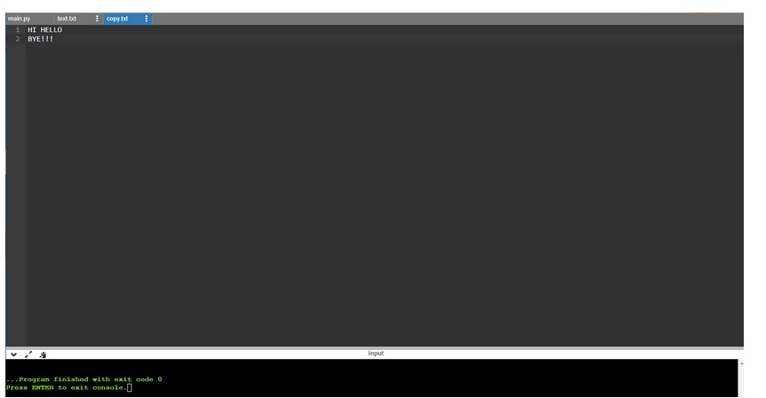

# copy-file
## AIM:
To write a python program for copying the contents from one file to another file.
## EQUIPEMENT'S REQUIRED: 
PC
Anaconda - Python 3.7
## ALGORITHM: 
### Step 1:
use open function to open the file in which we want to copy from and acess it in read mode.
### Step 2: 
 read the file and store in a variable.
### Step 3: 
now creat a new file in which we want to paste the content using write acess mode.
### Step 4:  
use write function to copy the read file that has been stored in the variable.
### Step 5: 
the content in the original file will be copied in the new file.
### Step 6: 
end the program. 
## PROGRAM:
with open('text.txt') as fp:
    with open('copy.txt','w') as fp1:
        cpy=fp.read()
        fp1.write(cpy)
### OUTPUT:

## RESULT:
Thus the program is written to copy the contents from one file to another file.